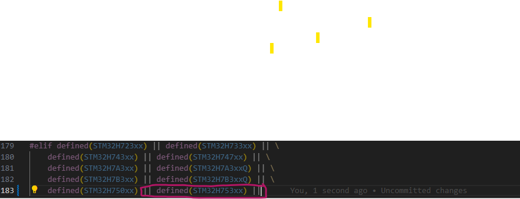

# HERE IS THE PROCESS FOR THE GENERATE THE FIRMWARE.
**--FOR NEW MCU WITH IN THE EXISTING PORTS THIS DOCUMENT REPRESENT SPECIALLY FOR THE STM32h7xxx Series MCU--**
### Requirement to changes 
- micropython/ports/stm32/
    - adc.c
        - **change the adc.c file with adding the new microcontroller name  as shown in the below image. make sure that you placed in the correct MCU family **
        - 

    - boards/    
        - stm32h573_af.csv
        - stm32h573.ld
        - NUCLEO_H743ZI/

