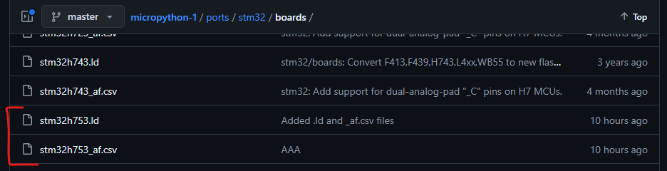

# HERE IS THE PROCESS FOR THE GENERATE THE MicropythonFIRMWARE for STM32 MCU.
**--FOR NEW MCU WITH IN THE EXISTING PORTS THIS DOCUMENT REPRESENT SPECIALLY FOR THE STM32h7xxx Series MCU--**
- *Note:- Based on the this doucmentation you can generate yourself micropython Firmware for the new MCU for existing family.*
### Requirement to changes 
- ### micropython/ports/stm32/
    - ### adc.c
        - **change the adc.c file with adding the new microcontroller name  as shown in the below image. make sure that you placed in the correct MCU family **
        - 

    - ### boards/  
         *create one directory **NUCLEO_H753ZI and create .ld & .csv** files,  copy the previous version files ( in my case use **From** H743ZI of the stm32h743_af.csv and stm32h743.ld **To** stm32h753_af.csv and stm32h753.ld)rename the file to match with your **MCU** name. check documentation for your correct **MCU** for the deep understanding and modification.(https://www.st.com/en/microcontrollers-microprocessors/stm32h743-753/products.html)* 
        - [Link to stm32h753 PDF](stm32h753vi.pdf)
        - *change the stm32h573.ld file with adding the new microcontroller name as shown in the below image.*
        - 
        - stm32h573_af.csv            
        - stm32h573.ld
        
        - #### NUCLEO_H753ZI/
              copy all the previous version files ( in my case use **From** NUCLEO_H743ZI  **To** ) rename the file  whch are marked with **RED** , to match with your **MCU** name and marked with **GREEN** is no need to change. 

            1. Modify pins.csv (*--to match the GPIO, UART, I2C, SPI,ETHERNET--*)
            2. Modify mpconfigboard.h (*--to match with the above 
                pins.csv--*)            
                 
            - board.json
             *Modify the MCU name as underline in the below image.*
              
            - board_init.c    
             *Modify the MCU name as underline in the below image.*
               
            - manifest.py 
             *No Change*              
            - mpconfigboard.h 
             *Modify the MCU name as underline in the below image.*
              
            - mpconfigboard.mk 
             *Modify the MCU name as underline in the below image.* 
             
            - pins.csv
             *Modify the MCU name as underline in the below image.*
                                    
            - stm32h7xx_hal_conf.h
             *No Change*

